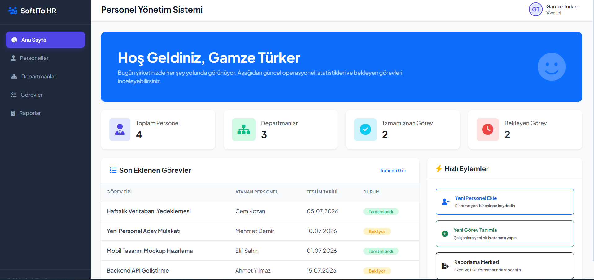
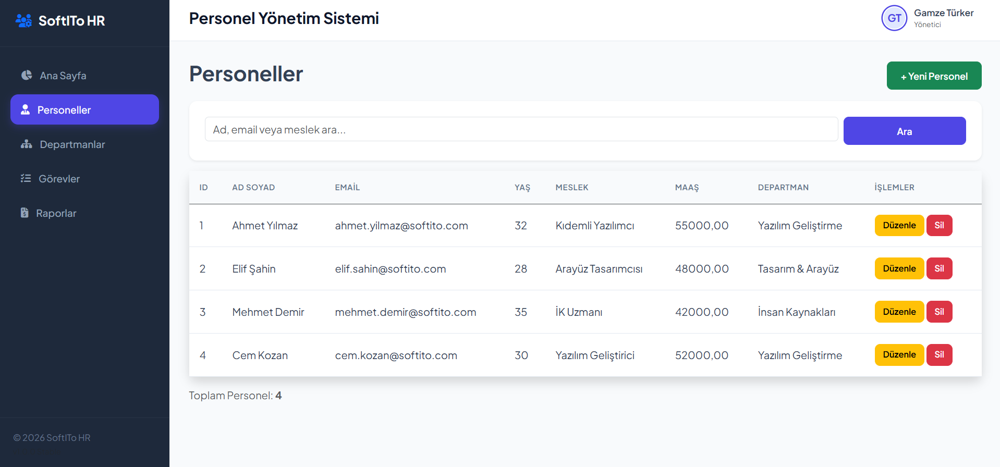
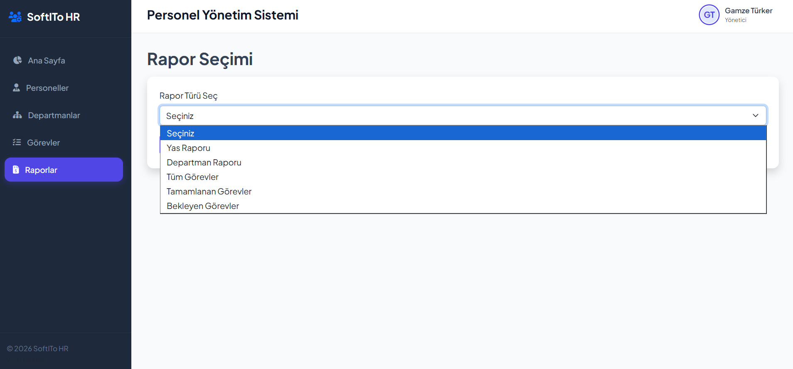
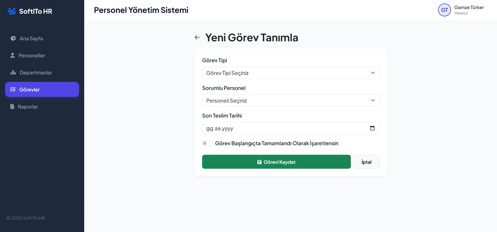
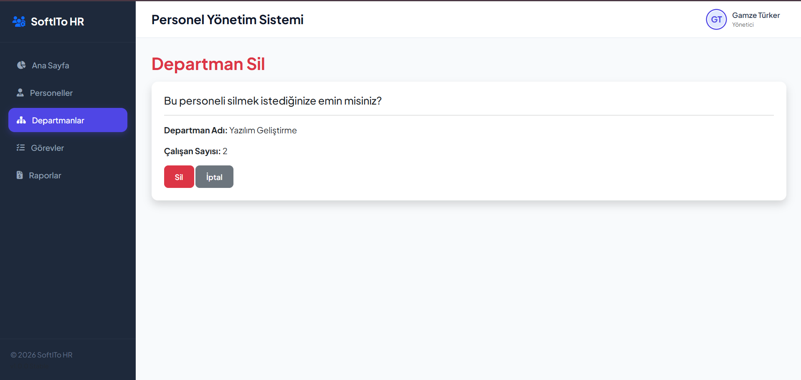

🏢 CalisanSistemiKatmanli - Personnel Management System

📖 About
CalisanSistemiKatmanli is a multi-layered ASP.NET Core MVC application designed for human resources and employee management. All data layers, business logic, and UI forms are structured inside clean assemblies running on Entity Framework Core and MS SQL Server.

The application features an elegant sidebar navigation theme with dynamic analytics widgets on the dashboard. It also contains database seeding features to instantiate Turkish test data automatically and Excel & PDF exporting engines (via EPPlus and iTextSharp) inside the unified Reporting module.

🛠️ Technologies
- ASP.NET Core MVC (.NET 10.0)
- Entity Framework Core (SQL Server)
- MS SQL Server (LocalDB)
- EPPlus (Excel Report Support)
- iTextSharp (PDF Report Support)
- Bootstrap 5, FontAwesome & Plus Jakarta Sans (UI Theme)

🚀 Features
- **Modern Dashboard Panel:** Quick overview cards displaying total personnel counts, departments, completed tasks, pending tasks, and recent task lists.
- **Relational Data Management:** Full CRUD operations for Personeller, Departmanlar, and Görevler.
- **Auto-Seeding Engine:** Database migrations and sample Turkish mock data are set up at startup.
- **Reporting Hub:** Mapped to a unified RaporModel, letting admins download Excel and PDF exports.
- **Responsive Layout:** Elegantly formatted sidebar adapts cleanly to mobile devices.

📷 Screenshots
### Kontrol Paneli (Dashboard Home)

### Personel Yönetimi (Employee Directory)

### Raporlama Merkezi (Reporting Center)

### Veri Giriş Formları (Forms)

