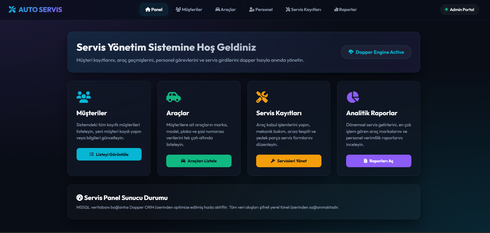
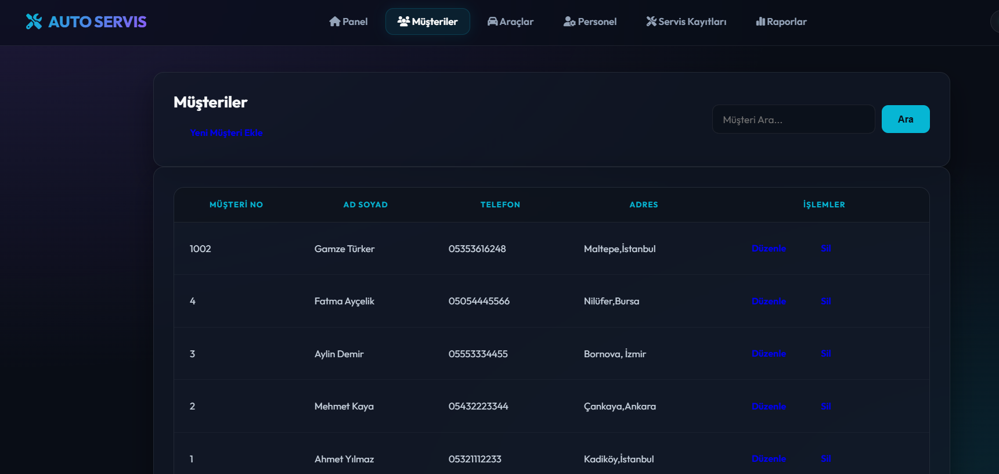
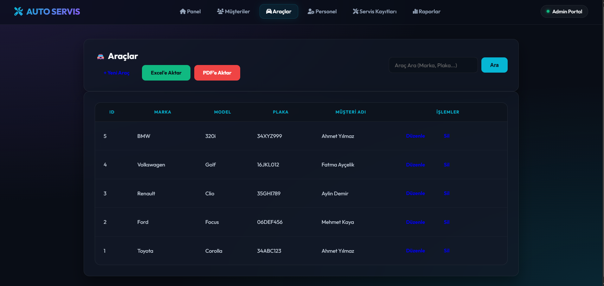
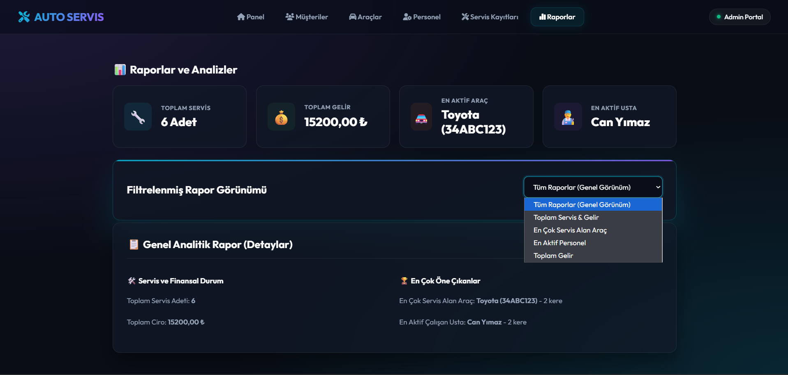
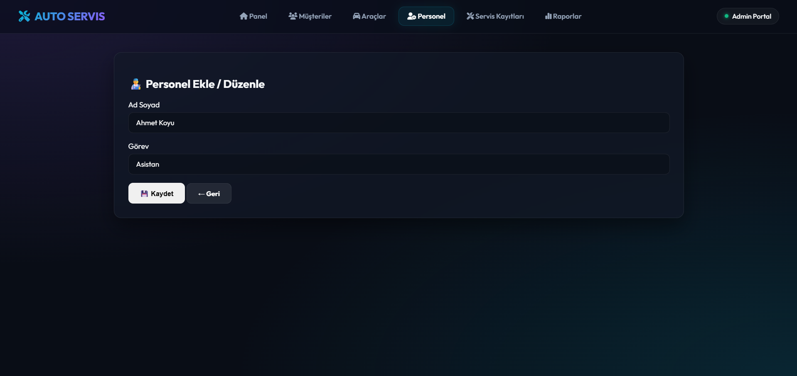
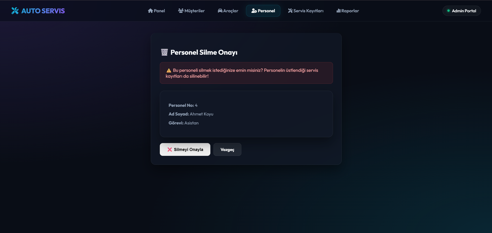

🚗 dpperUygulama - Auto Service Management Portal

📖 About
dpperUygulama is an ASP.NET Core MVC application integrated with Dapper ORM. It serves as an administrative CRM and tracking portal for automobile mechanic services, handling Customers, Vehicles, Employees, and Service Records.

The database queries are executed using lightweight raw SQL operations via Dapper, providing exceptionally fast load times and optimized transaction management on MS SQL Server. The user interface features a custom horizontal glassmorphism navigation layout with cyberpunk purple and neon cyan accents.

🛠️ Technologies
- ASP.NET Core MVC (.NET 10.0)
- Dapper ORM (Micro-ORM)
- MS SQL Server (LocalDB)
- Bootstrap 5, FontAwesome & Outfit (UI Theme)

🚀 Features
- **Top Glassmorphism Navbar:** High-end horizontal menu with frosted-glass backdrop effects.
- **Relational Auto-Service Schemas:** Tracking for Müşteriler (Customers), Araçlar (Vehicles), Personeller (Employees), and Servis Kayıtları (Service Records).
- **Raw SQL Performance:** High-performance database queries and updates via Dapper micro-ORM.
- **SQL Seeding Script:** Ready-to-run database configurations under `AracServisDB.sql`.
- **Responsive Layout:** Clean mobile-friendly viewports utilizing custom grid cards and panels.

📷 Screenshots
### Kontrol Paneli (Dashboard Home)

### Kayıt Listeleri (Directories)

### Raporlar ve Analiz (Reporting)

### Veri Giriş İşlemleri (Operations)

