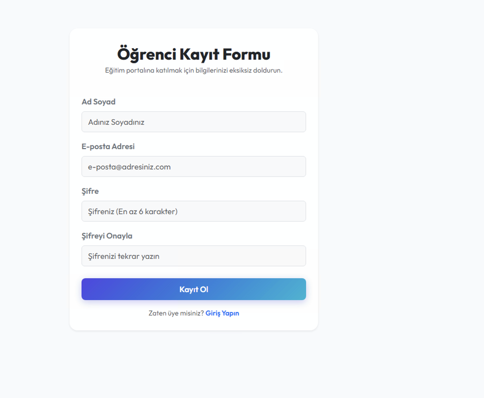
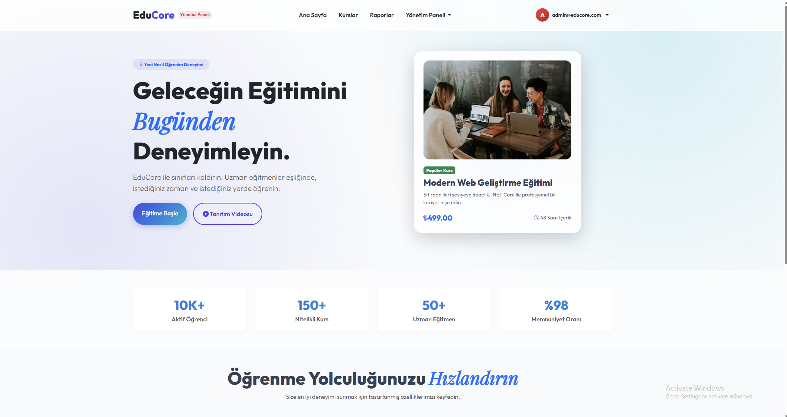
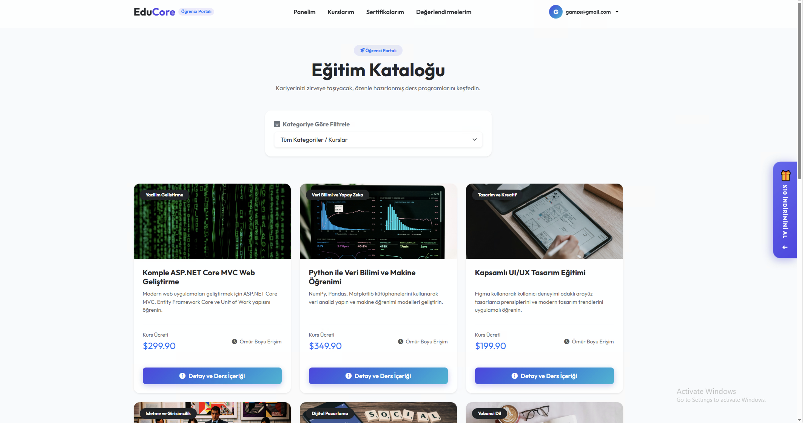

🎓 EduCore - Online Education Platform
📖 About
EduCore is a comprehensive ASP.NET Core MVC web application designed for online learning and course management. It features a responsive Bootstrap interface tailored for both students and administrators. 
Students can browse course catalogs, filter courses by category, enroll in training programs, watch interactive curriculum lessons, submit reviews, and track progress. The student dashboard also includes a premium floating discount coupon widget powered by dynamically generated QR Codes. 
Administrators are equipped with management panels for categories, courses, and lessons, as well as a centralized reporting system displaying system-wide analytics using optimized LINQ queries (Joins, Groupings, and Where filters). The reporting page uses a unified, single `Report` model to store and map all reporting properties. 
High performance is maintained throughout the system via strategic in-memory caching (`IMemoryCache`) with automatic cache invalidation rules when enrollments or reviews are updated.
🛠️ Technologies
- ASP.NET Core MVC (net10.0)
- Entity Framework Core
- MS SQL Server
- QRCoder (QR Code Generation)
- Microsoft Extensions Caching Memory (IMemoryCache)
- Serilog (Structured Logging)
- Bootstrap 5 & Bootstrap Icons
📷 Screenshots

### Giriş ve Kayıt Ekranları (Login & Sign Up)

### Gösterge Panelleri (Dashboards)

