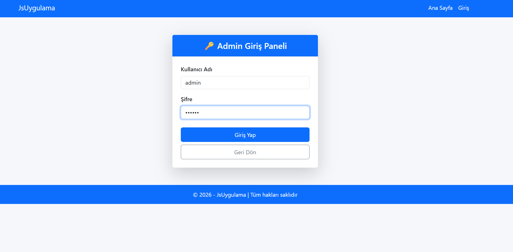
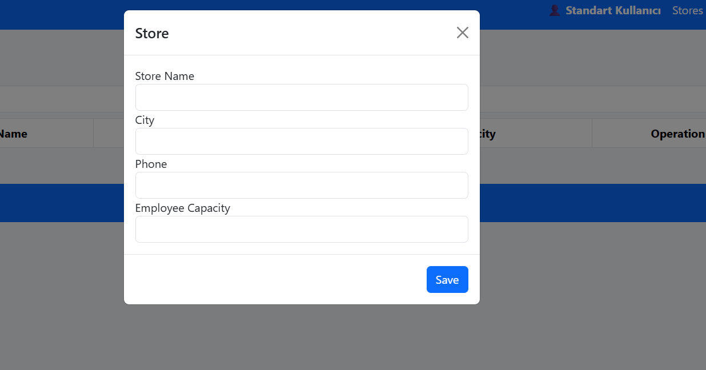
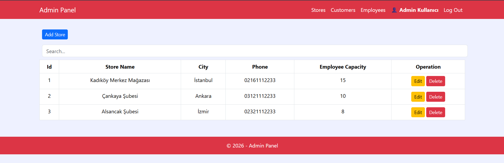
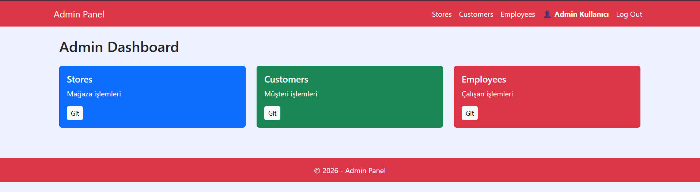
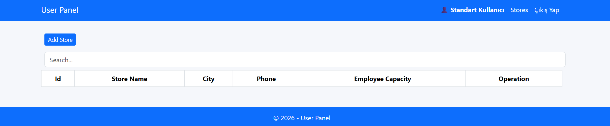
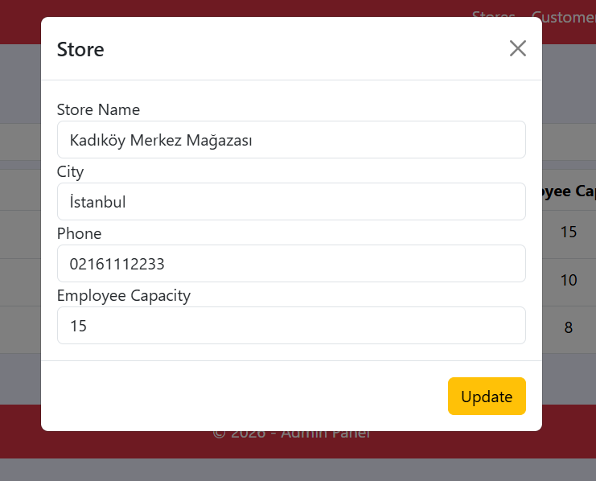
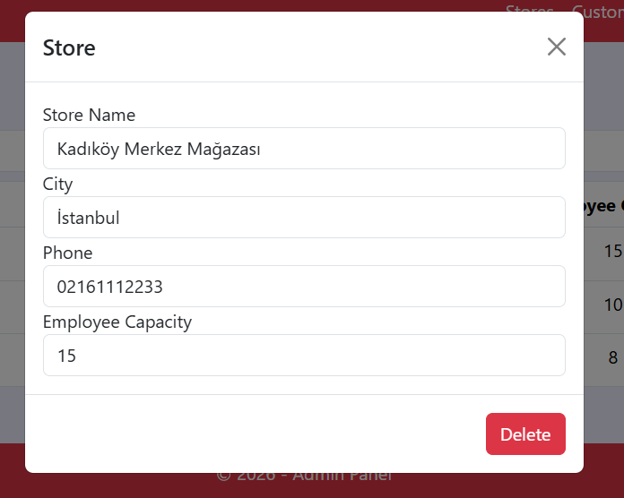

🛒 JavaScriptUygulamasi - Online Store Application

📖 About
JavaScriptUygulamasi is an ASP.NET Core MVC online e-commerce and store application featuring relational product listings, category management, and cart operations. The backend handles secure administrative operations and dynamic queries via MS SQL Server.

It includes an interactive front-end powered by vanilla JavaScript, clean Bootstrap styling, custom modals, and AJAX operations. Administrators can manage inventories, products, and categories, while regular users can browse catalog products in a responsive grid layout.

🛠️ Technologies
- ASP.NET Core MVC (.NET 10.0)
- Entity Framework Core (SQL Server)
- MS SQL Server (LocalDB)
- Vanilla JavaScript & AJAX
- Bootstrap 5 & Custom CSS

🚀 Features
- **Admin & User Role Portals:** Dedicated dashboards for admins (inventory management) and users (shopping interface).
- **Interactive JavaScript Actions:** Real-time search, cart updates, and modal alerts without page reloads.
- **Relational Store Inventory:** Linked tables for Categories and Products with full CRUD support.
- **SQL Seeding Script:** Ready-to-run `StoreDB.sql` database configuration.
- **Clean Forms:** Validation-backed inputs for adding, editing, and deleting store inventory.

📷 Screenshots
### Giriş Ekranı (Login Screen)

### Mağaza Arayüzü (Store Front)

### Yönetim Panelleri (Dashboards)

### Veri Girişi ve Düzenleme (Operations)

