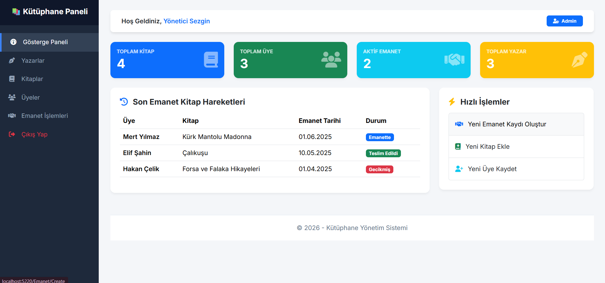

📚 LibrarySystem - Library Management System

📖 About
LibrarySystem is a multi-layered ASP.NET Core application built with a Web API and an MVC web portal. All database operations are implemented using Dapper and ADO.NET, communicating exclusively with MS SQL Server using Stored Procedures.

It allows administrators to manage authors, books, members, and book borrowing activities through a responsive Bootstrap dashboard interface. The project includes searching, statistics calculation, and dynamic data reporting with Excel and PDF export downloads.

🛠️ Technologies
- ASP.NET Core MVC & Web API (.NET 10.0)
- Dapper & ADO.NET (Stored Procedures)
- MS SQL Server (LocalDB)
- EPPlus (Excel Exporting)
- iTextSharp (PDF Exporting)
- Bootstrap 5 & FontAwesome (UI)

🚀 Features
- **Admin Authentication:** Cookie-based secure login validating credentials via Web API.
- **Relational Data Management:** CRUD support for Yazarlar, Kitaplar, Uyeler, and Emanetler.
- **Excel & PDF Exports:** Clean tabular data export support for all major lists.
- **Advanced Search:** Integrated search inputs to filter lists dynamically.
- **Statistics Dashboard:** Counters and quick action widgets on the homepage.

📷 Screenshots
### Giriş ve Kayıt Ekranları (Login & Sign Up)

### Gösterge Panelleri ve Tablolar (Dashboards & Lists)

