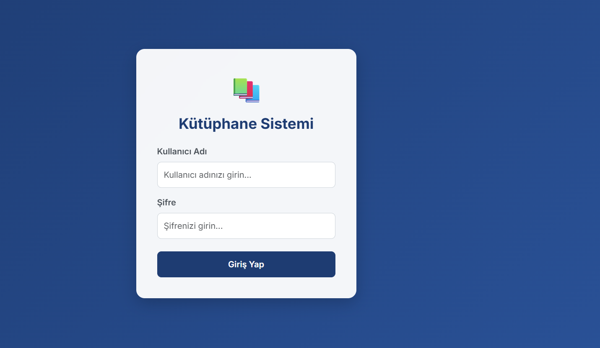
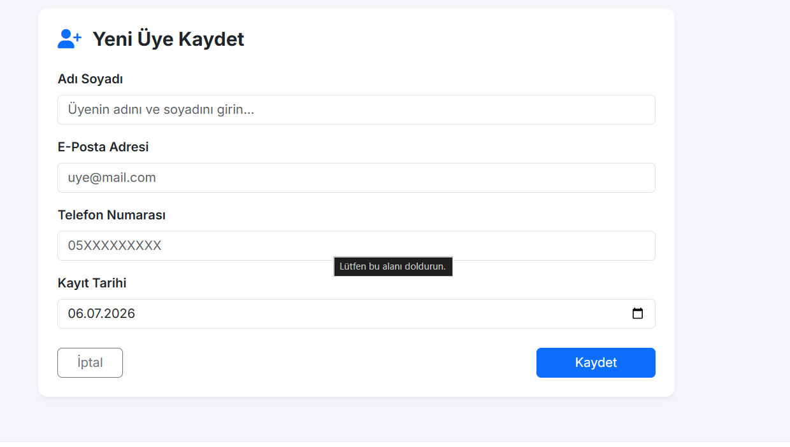
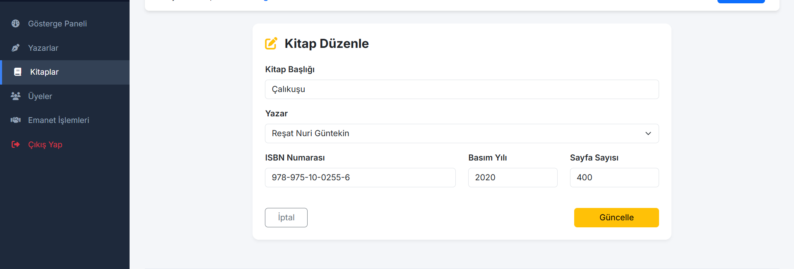
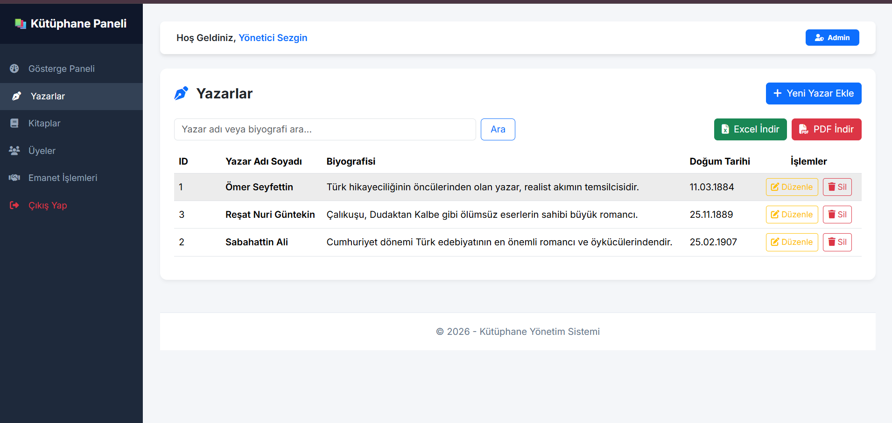

📚 LibrarySystem - Library Management System

📖 About
LibrarySystem is a comprehensive ASP.NET Core application structured with a Web API backend and an MVC frontend web portal. All database interactions are written in Dapper and ADO.NET using optimized Stored Procedures for high performance. 

The application provides administrators with a responsive Bootstrap panel to manage authors, books, members, and active book borrowings. It includes search functionality across all modules and enables downloading clean reports in Excel (via EPPlus) and PDF (via iTextSharp) formats.

🛠️ Technologies
- ASP.NET Core MVC & Web API (.NET 10.0)
- Dapper & ADO.NET (Stored Procedures)
- MS SQL Server (LocalDB)
- EPPlus (Excel Report Support)
- iTextSharp (PDF Report Support)
- Bootstrap 5 & FontAwesome (UI)

🚀 Features
- **Secure Admin Panel:** Cookie-based authentication verifying admin credentials from the database via Web API.
- **Relational Data Modeling:** Full CRUD operations for Yazarlar, Kitaplar, Uyeler, and Emanetler.
- **Advanced Search Filters:** Dynamic search filters on list pages.
- **Excel & PDF Exports:** Instant downloads of formatted tables for reporting.
- **Home Dashboard:** High-level overview counters for total books, members, active borrowings, and a list of recent activities.

📷 Screenshots
### Giriş Paneli (Login Panel)

### Gösterge Paneli (Dashboard Home)

### Veri Giriş Formları (Data Entry Forms)

### Kayıt Listeleri (Record Tables)

