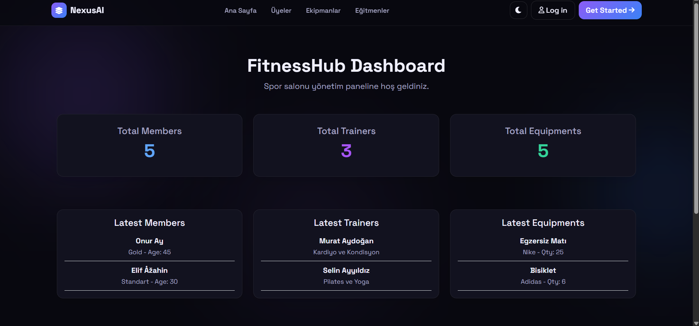
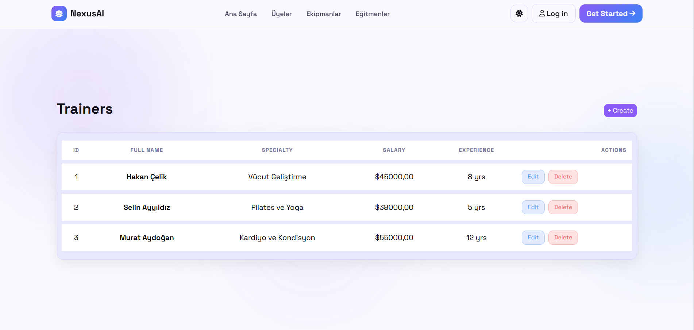
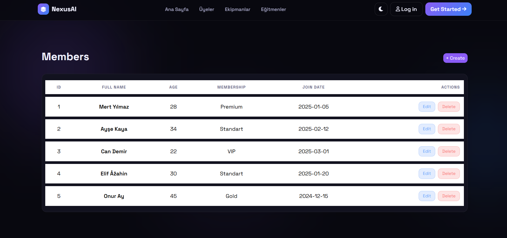
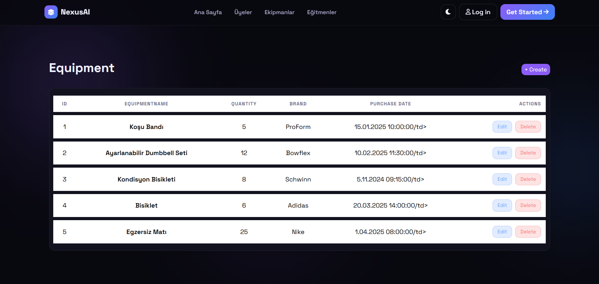
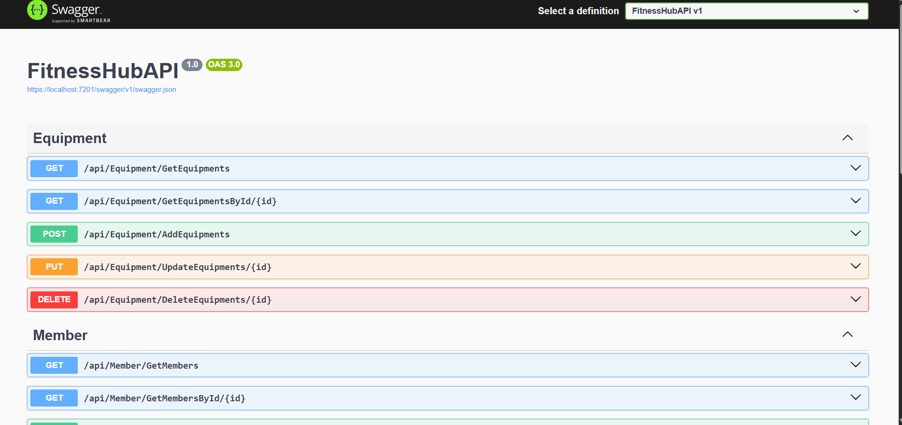
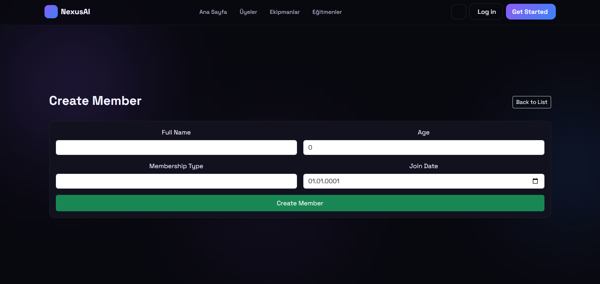

🏋️ MvcApiProjesi - Fitness Hub Management System

📖 About
MvcApiProjesi is a gym and fitness center management application structured around a decoupled architecture. It comprises an ASP.NET Core Web API backend (`FitnessHubAPI`) and an ASP.NET Core MVC web portal (`FitnessHubMVC`) that consumes the API endpoints to manage gym operations.

The backend exposes RESTful services documented via Swagger, connecting to an MS SQL Server database. The MVC client provides trainers, members, and equipment management forms styled with Bootstrap and interactive layouts.

🛠️ Technologies
- ASP.NET Core Web API & MVC Portal (.NET 10.0)
- Entity Framework Core (SQL Server)
- MS SQL Server (LocalDB)
- Swagger / OpenAPI (API Documentation)
- Bootstrap 5 & Custom CSS

🚀 Features
- **Decoupled Architecture:** Separation between the backend database service and the customer-facing portal.
- **Member Directory:** Track gym membership details, registration dates, and status.
- **Trainer Portals:** Manage gym trainers, specialties, and contact records.
- **Equipment Inventory:** Catalog gym machines, weights, and maintenance status.
- **Interactive REST Services:** Complete Swagger integration for backend API testing.

📷 Screenshots
### Kontrol Paneli (Dashboard Home)

### Eğitmenler ve Üyeler (Directory)

### Envanter Yönetimi (Equipment)

### Swagger API Dokümantasyonu

### Giriş ve Düzenleme Arayüzleri (Operations)

.png)
