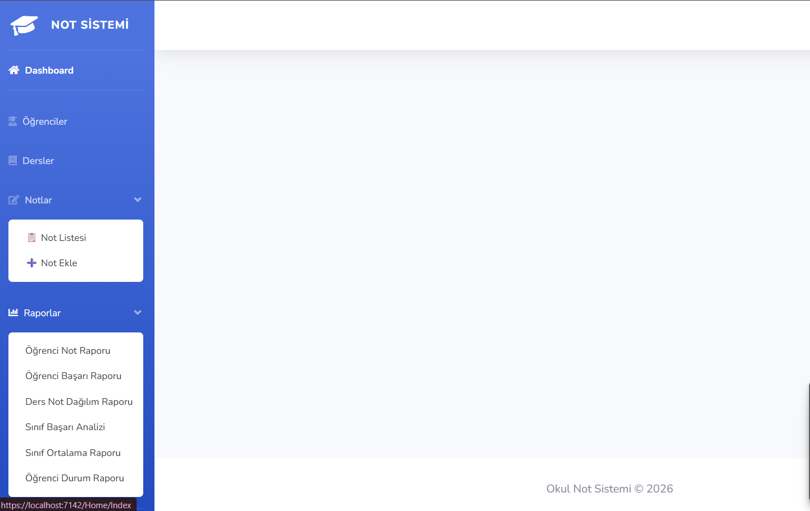
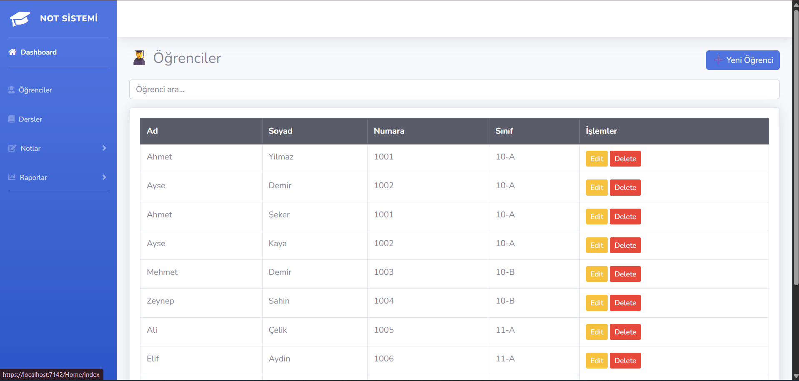
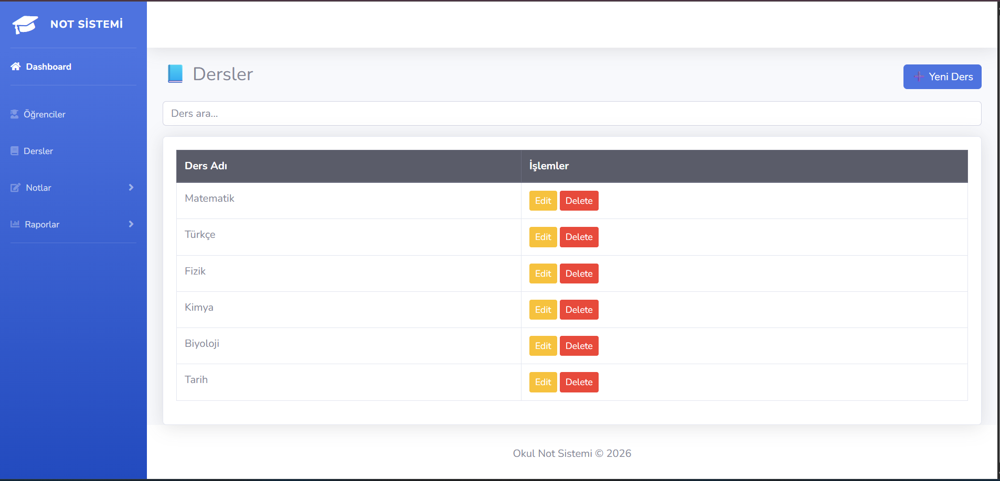
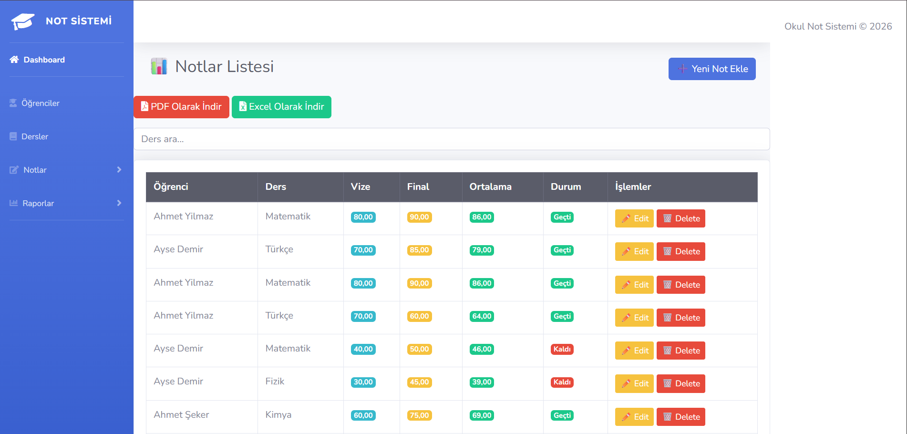
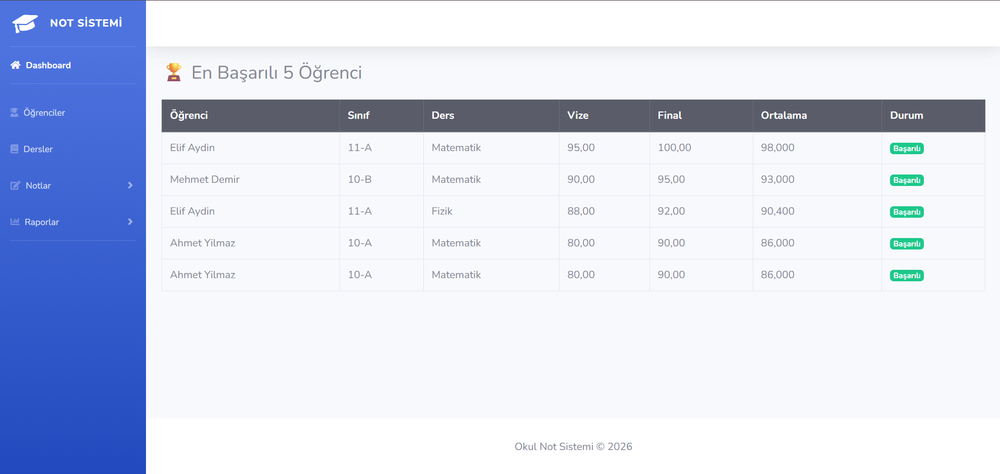
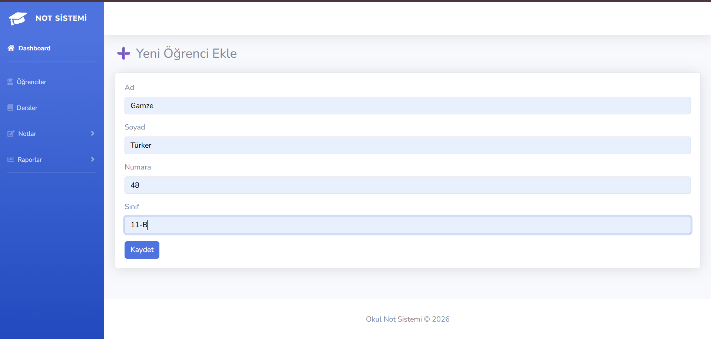
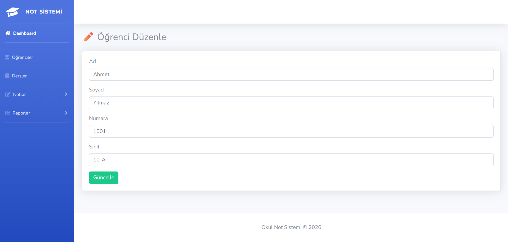
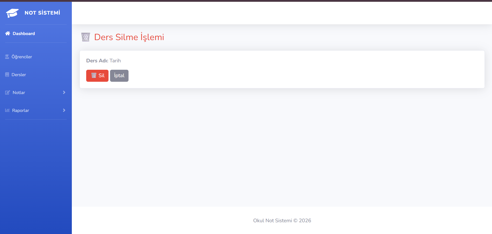

🏫 OkulNotSistemi - Student Grading Portal

📖 About
OkulNotSistemi is an ASP.NET Core MVC application developed for educational institutions, allowing administrators and teachers to manage student registers, lesson catalogs, and grading lists.

The application features clean navigation layouts, interactive score management tables, and student transcripts.

🛠️ Technologies
- ASP.NET Core MVC (.NET 10.0)
- Entity Framework Core (SQL Server)
- MS SQL Server (LocalDB)
- Bootstrap 5 & FontAwesome (UI Theme)

🚀 Features
- **Dashboard Overview:** Homepage displays fast navigation buttons and system summaries.
- **Student Directory:** Keep track of student records, emails, and enrollment parameters.
- **Lesson Catalog:** Manage courses, lesson codes, and class associations.
- **Grade & Scores Panel:** Manage student grades, exam scores, and calculation rules.
- **Report Cards:** Dynamic transcript and grade summary page for students.

📷 Screenshots
### Kontrol Paneli (Dashboard Home)

### Öğrenci ve Ders Yönetimi (Directory)

### Not Sistemi (Grading Panel)

### Kayıt İşlemleri (Operations)

