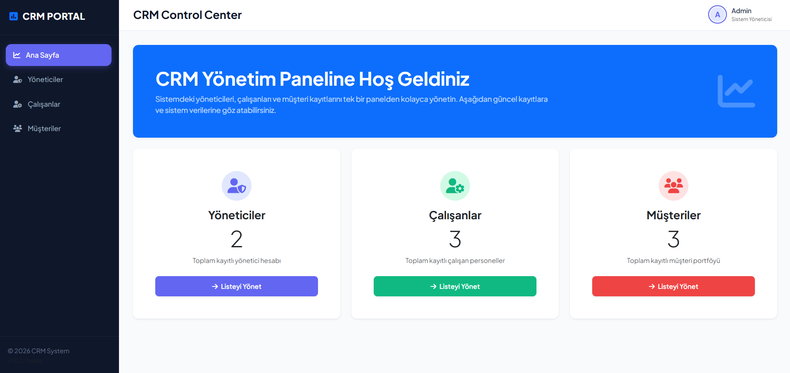
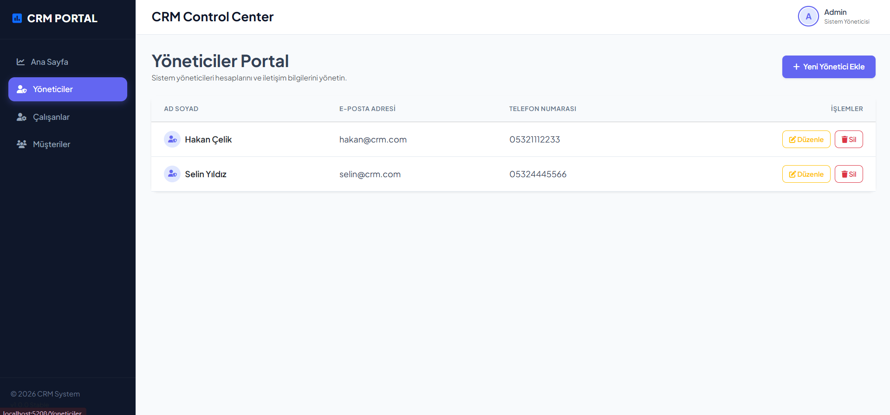
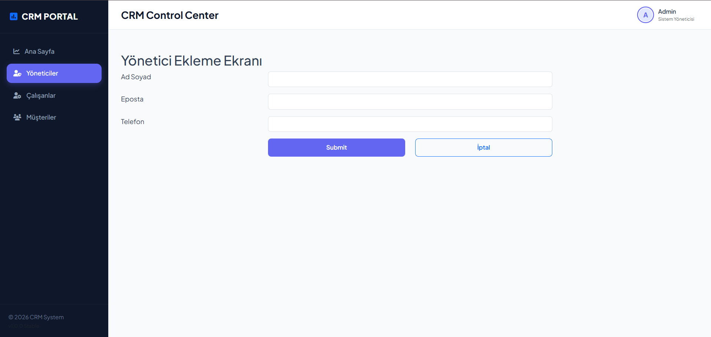
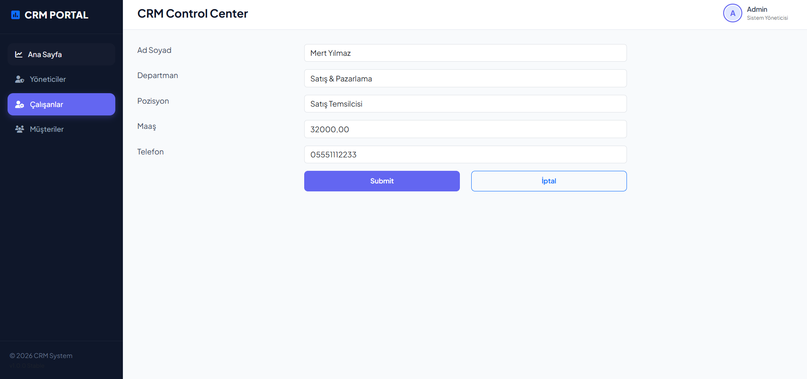
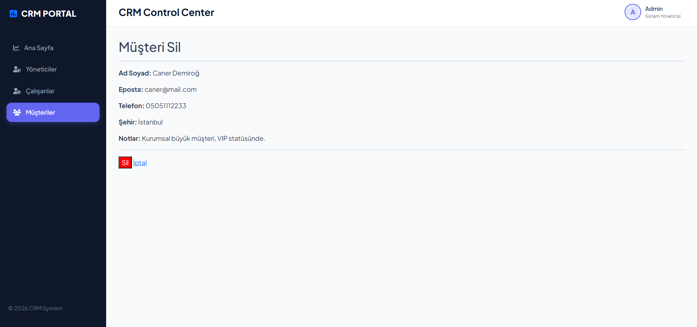

📊 RazorPageUygulamasi - CRM Portal

📖 About
RazorPageUygulamasi is a clean, multi-page Customer Relationship Management (CRM) portal built with ASP.NET Core Razor Pages. It offers a structured way to keep track of system Administrators, company Employees, and Customer registries, with database interactions running on MS SQL Server.

The UI is dressed in a premium dashboard layout featuring a dark sidebar navigation, modern statistics cards, status widgets, and action forms. 

🛠️ Technologies
- ASP.NET Core Razor Pages (.NET 10.0)
- ADO.NET / Entity Framework Core (SQL Server)
- MS SQL Server (LocalDB)
- Bootstrap 5, FontAwesome & Plus Jakarta Sans (UI Theme)

🚀 Features
- **SaaS-Style Dark Sidebar:** Interactive sidebar menu layout that adapts cleanly to mobile devices.
- **Unified Analytics Dashboard:** Homepage displays live counts for Managers, Employees, and Customers with visual progress cards.
- **Modular Registries:** Dedicated pages and tables to organize and track CRM contacts.
- **SQL Seeding Script:** Ready-to-run database tables configured under `CRM_Sistemi.sql`.
- **Validation Forms:** User validation rules for clean data entry and edit commands.

📷 Screenshots
### Kontrol Paneli (Dashboard Home)

### Yönetici Kayıtları (Managers Directory)

### Kayıt ve Güncelleme İşlemleri (Operations)

