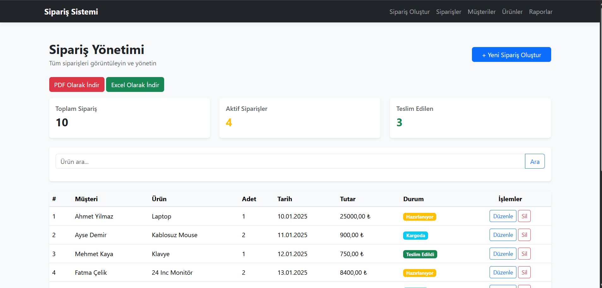
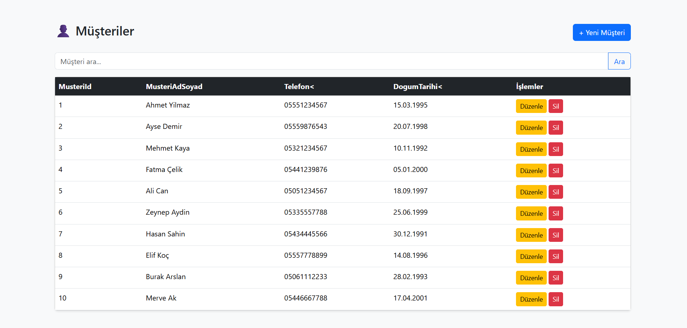
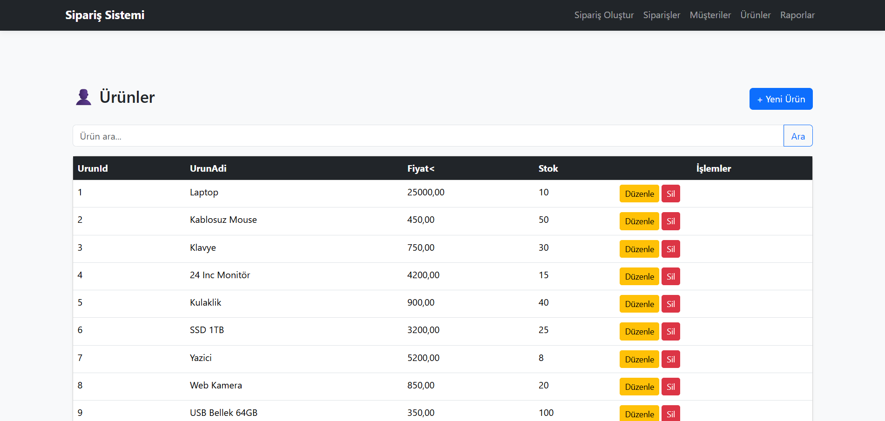
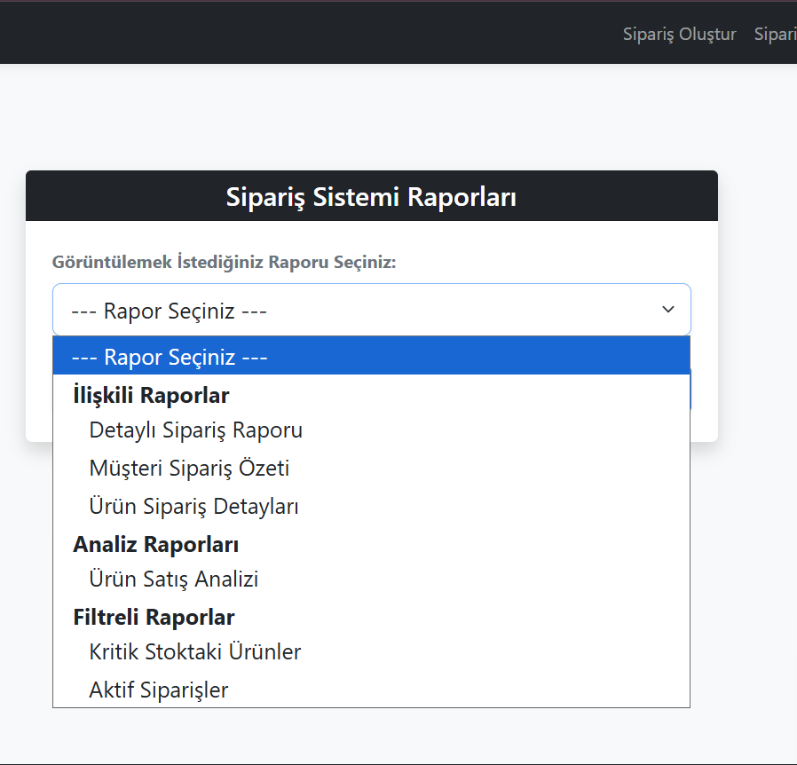
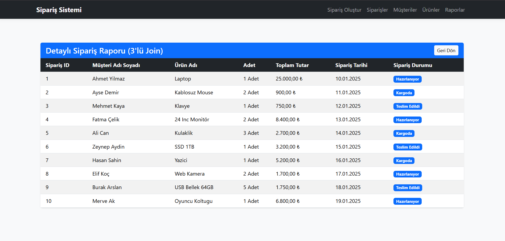
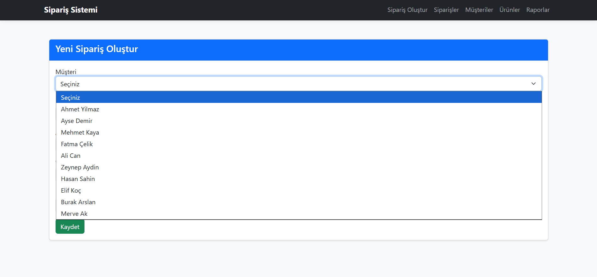
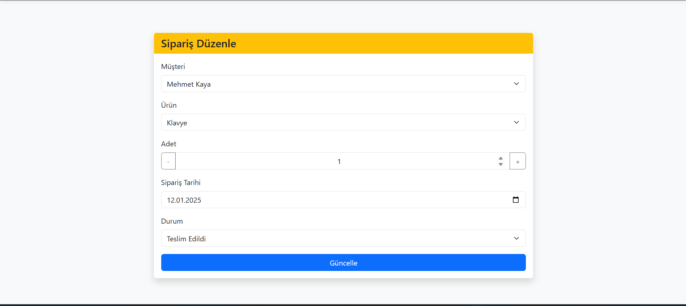
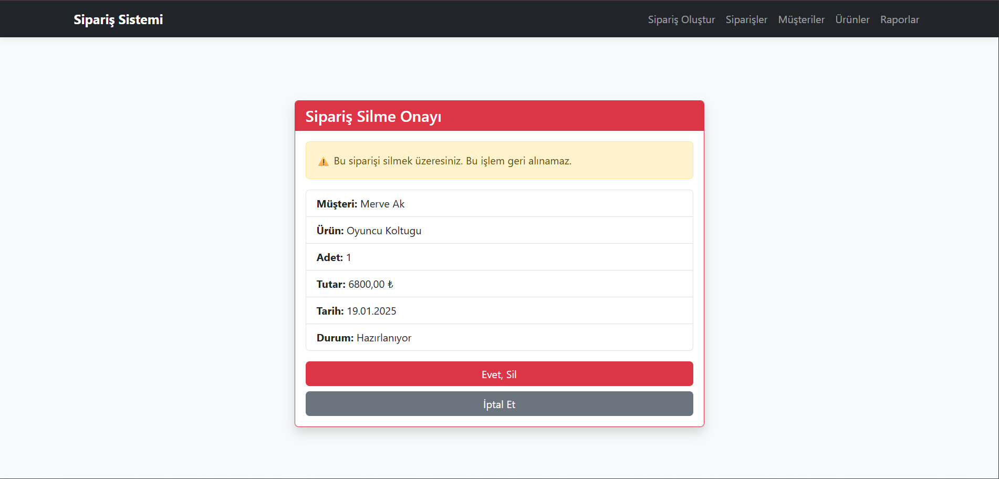

🛒 Order Management System
📖 About

The Order Management System is an ASP.NET Core MVC application developed using Entity Framework Core and MS SQL Server. It enables users to manage customers, products, and orders through a responsive Bootstrap interface. The project also includes reporting features with PDF and Excel export support, as well as sales analysis using LINQ queries.

🛠️ Technologies
ASP.NET Core MVC
Entity Framework Core
MS SQL Server
QuestPDF

## 📷 Screenshots

### Home Page

### Customers

### Products

### Orders

### Reports

### Report Details

### Create Order

### Edit Order

### Delete Order

