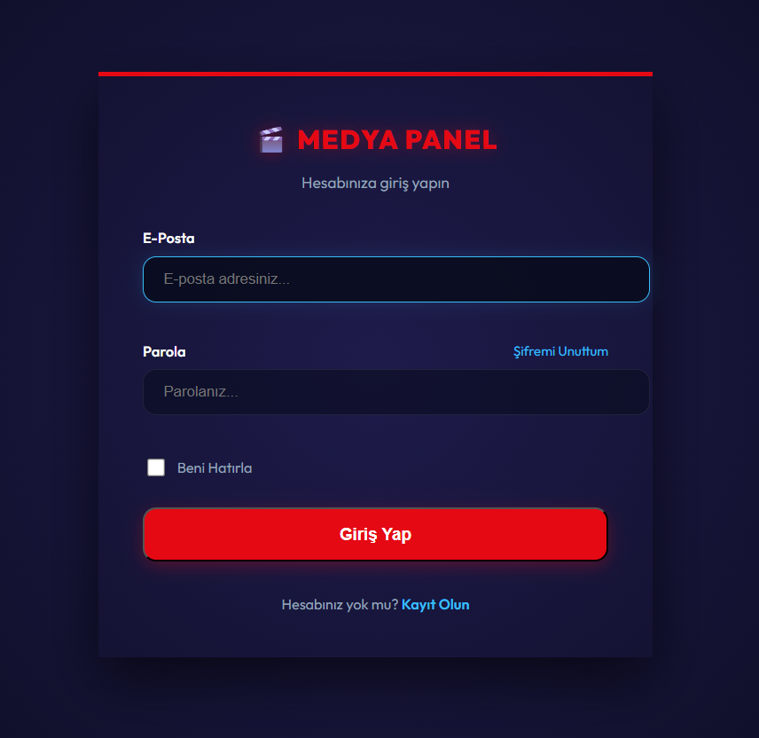
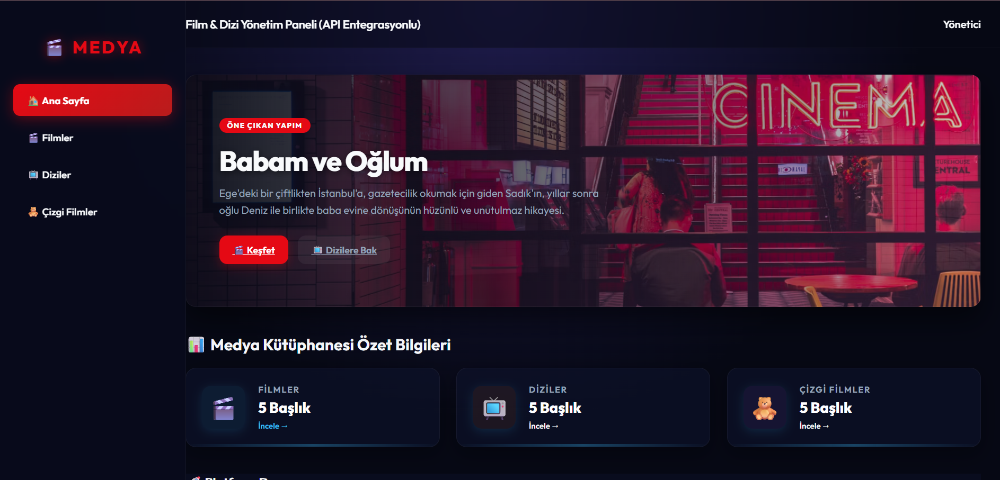
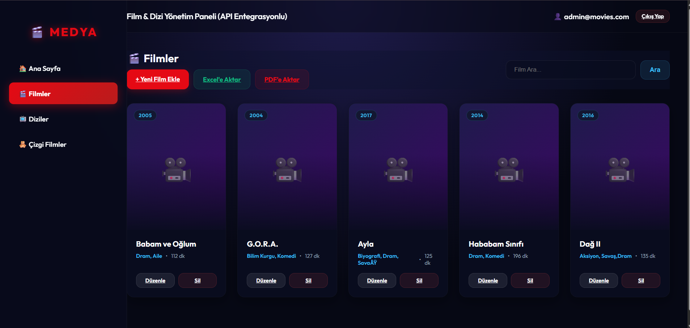
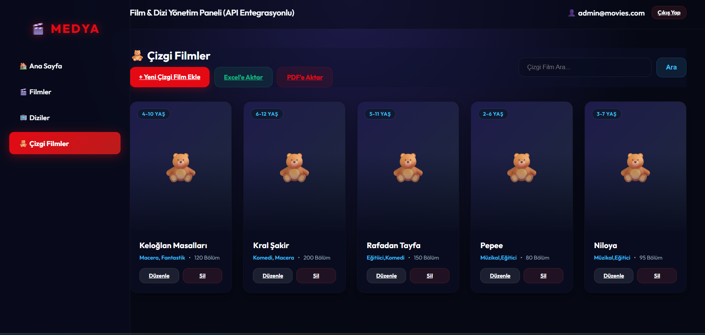
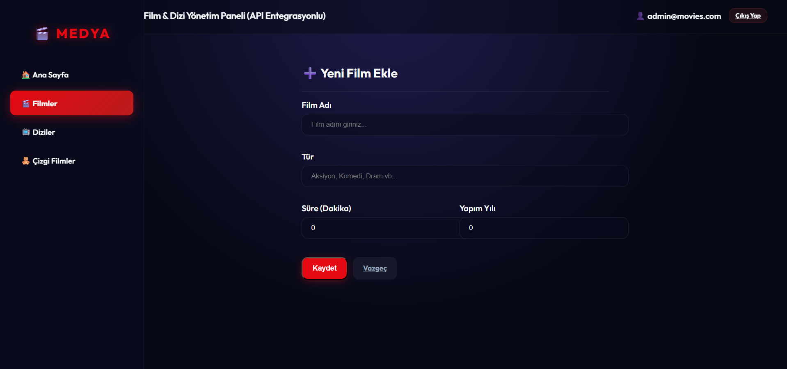
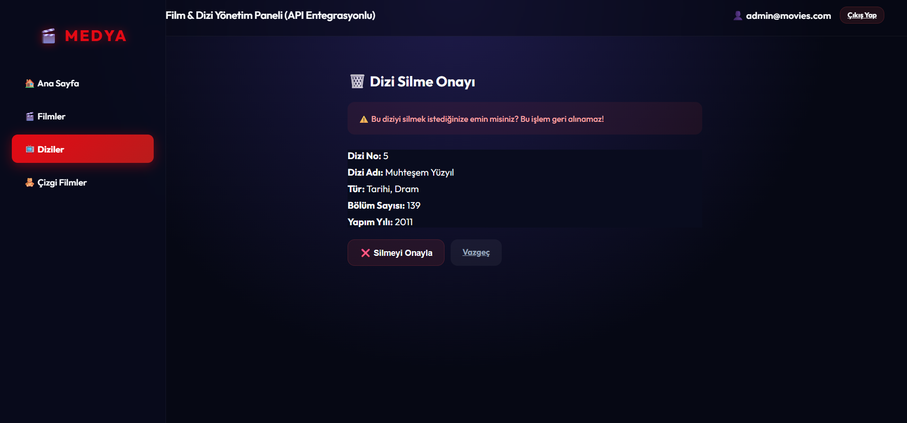

🎬 WebApiProjesi - Movies & Cartoons Portal

📖 About
WebApiProjesi is a multi-layered ASP.NET Core application powered by a Web API backend (`APIProject`) and a modern web portal interface (`WebProject`). It is built to catalog, search, and manage a directory of Movies and Cartoon/Anime series.

All database transactions run on Entity Framework Core and MS SQL Server. The web portal consumes the API services asynchronously via JSON endpoints to render listings, handle authentication, and allow authorized users to perform CRUD operations on the catalog.

🛠️ Technologies
- ASP.NET Core Web API & MVC Portal (.NET 10.0)
- Entity Framework Core (SQL Server)
- MS SQL Server (LocalDB)
- Bootstrap 5 & Custom CSS
- HttpClient (API Integration)

🚀 Features
- **API-First Architecture:** Complete separation of backend database endpoints and frontend rendering.
- **Relational Databases:** Catalog tables for Film ve Çizgi Film (Movies & Cartoons) details.
- **Client Authentication:** Login verification validating credentials against the user table via API.
- **Dynamic Grid Catalog:** Beautiful responsive view pages displaying movie titles, ratings, and media cards.
- **Admin Management Forms:** Interfaces for creating, editing, and deleting listings with automated database sync.

📷 Screenshots
### Giriş Sayfası (Login Page)

### Gösterge Paneli (Dashboard Home)

### Medya Listeleri (Media Catalogs)

### Yönetim ve Düzenleme (Operations)

